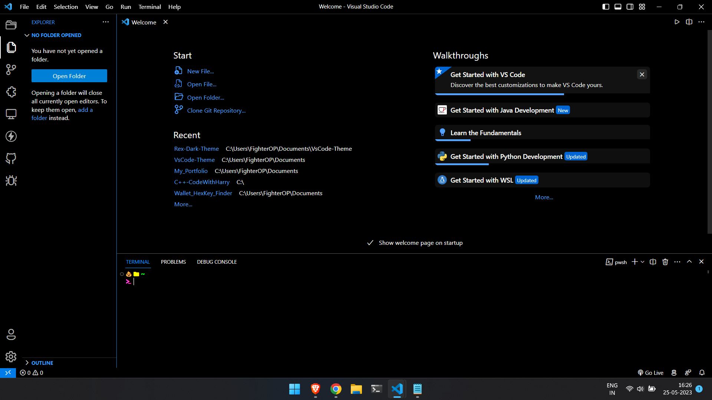
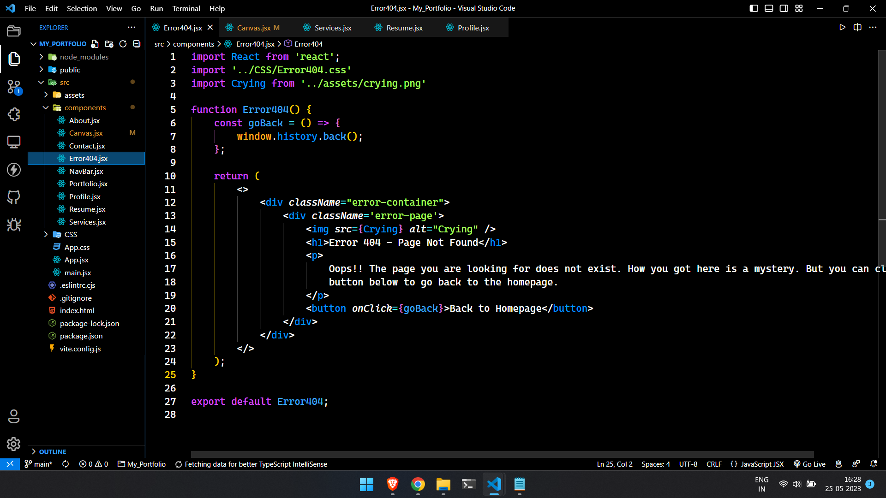
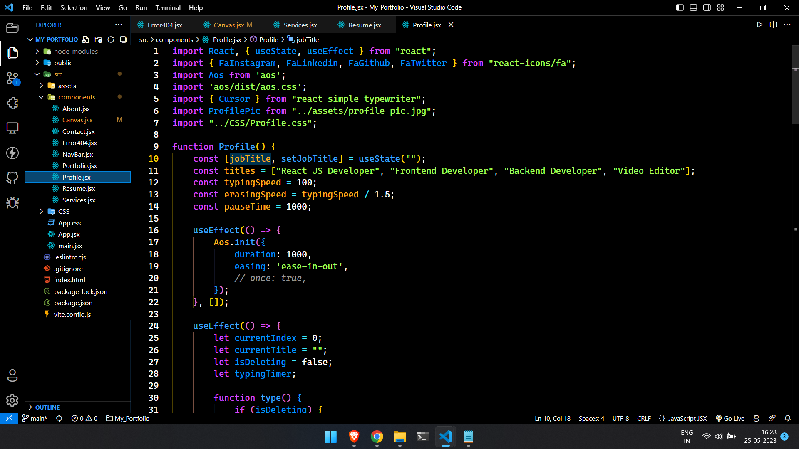

# Rex Dark Theme

A dark theme for Visual Studio Code, inspired by the classic [Rex Theme](https://www.vim.org/scripts/script.php?script_id=155).

## Features

- Dark background color
- Low contrast colors for syntax highlighting
- Optimized for readability
- Easy on the eyes

## Screenshots

## Installation

1. Open **Extensions** sidebar panel in Visual Studio Code. `View → Extensions`
2. Search for `Rex Dark Theme`
3. Click **Install** to install it
4. Click **Reload** to reload the Code window
5. From the menu bar click: Code > Preferences > Color Theme > **Rex Dark Theme**

## Screenshots

## Contributing

Contributions are always welcome!

1. Fork the repository
2. Create your feature branch: `git checkout -b my-new-feature`
3. Commit your changes: `git commit -am 'Add some feature'`
4. Push to the branch: `git push origin my-new-feature`
5. Submit a pull request

## License

This project is licensed under the terms of the [MIT License](https://opensource.org/licenses/MIT).

## For more information

* [Visual Studio Code's Markdown Support](http://code.visualstudio.com/docs/languages/markdown)
* [Markdown Syntax Reference](https://help.github.com/articles/markdown-basics/)

**Enjoy!**