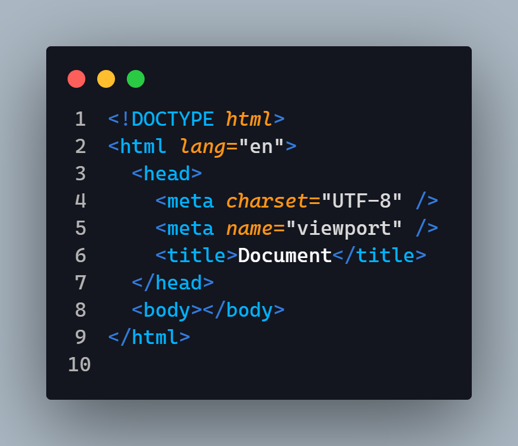
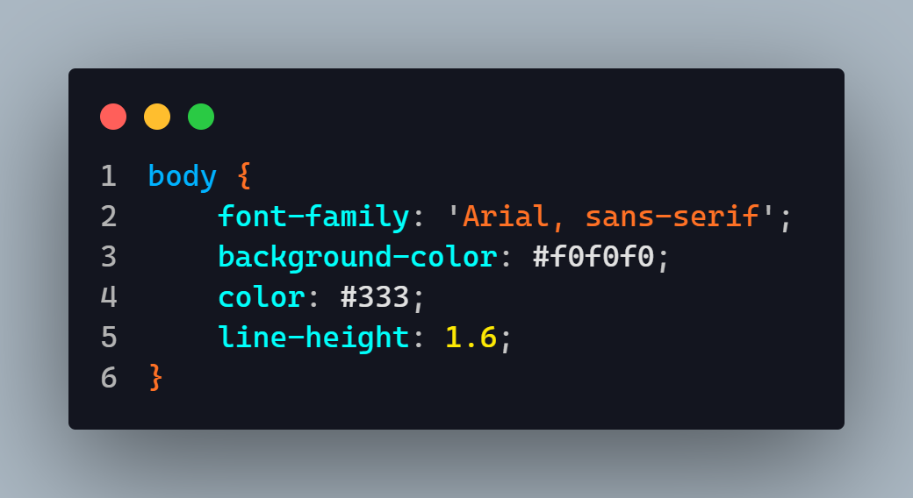
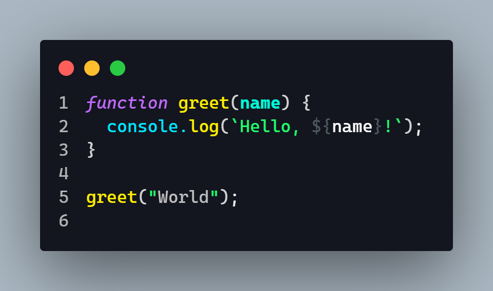
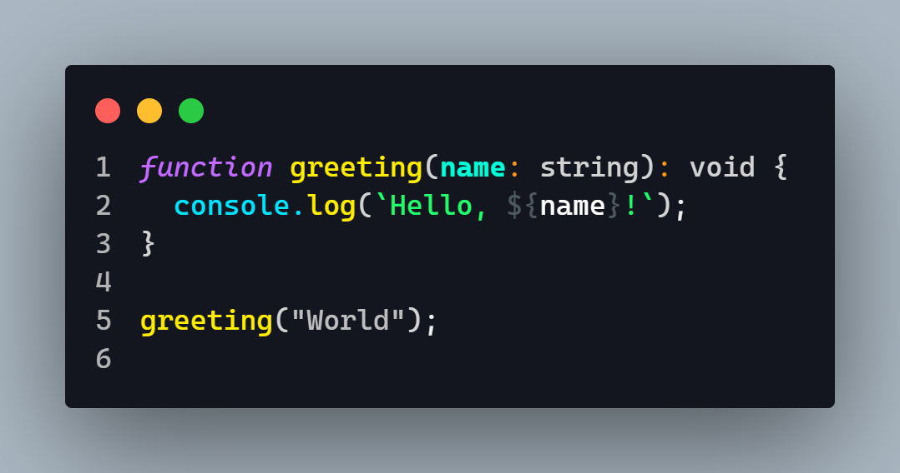
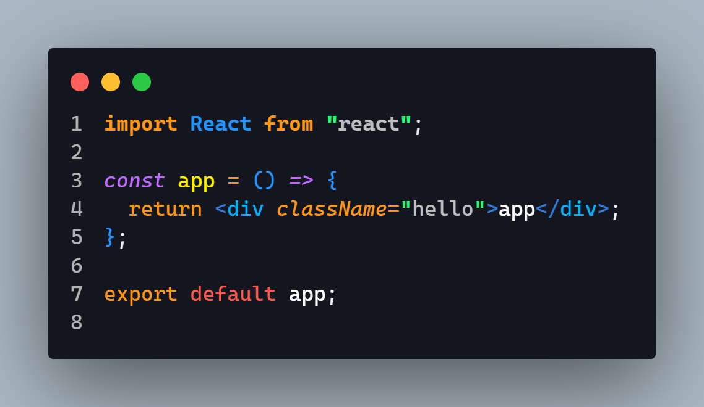
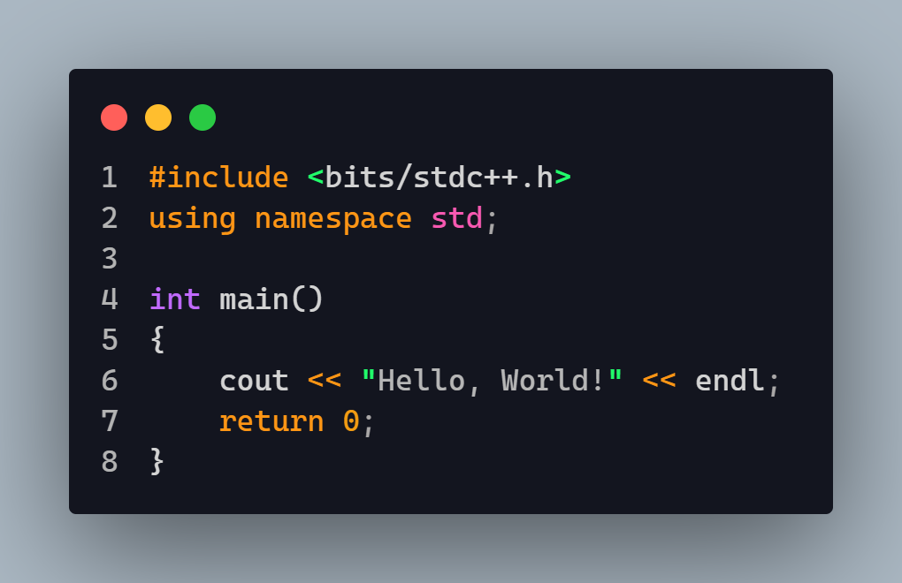
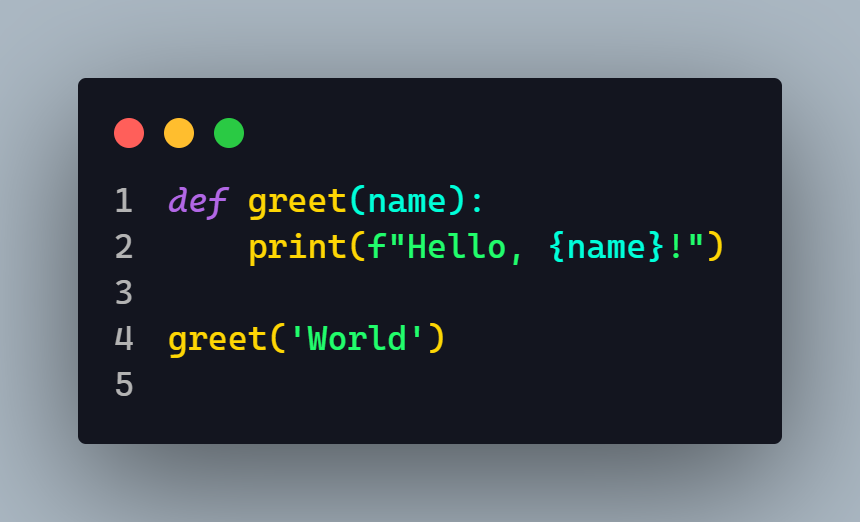
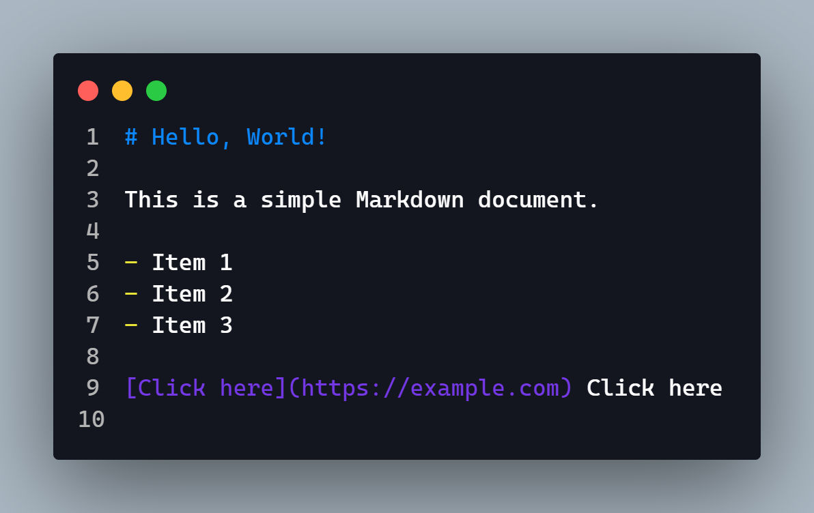
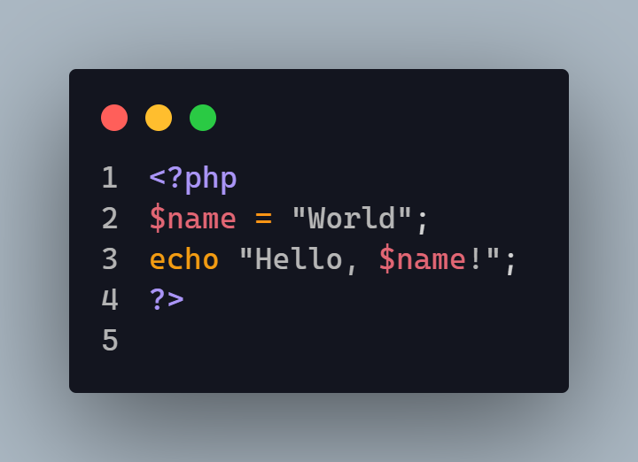

# Rex Dark Theme

**Elevate your coding experience with Rex Dark Theme, an eye-catching dark theme for Visual Studio Code!**

🌙 **Get Rex Dark Theme now:** [Marketplace Link](https://marketplace.visualstudio.com/items?itemName=FighterOP.rex-dark-theme)

## Features

- **Dark Background Color:** Reduce eye strain and make your code stand out with a visually appealing dark background.
- **Syntax Highlighting:** Carefully selected contrast colors ensure your code is easy to read and understand.
- **Readability Optimization:** The theme is optimized for readability, making it easier for you to navigate and comprehend your code.
- **Eye-Friendly Design:** Rex Dark Theme considers the comfort of your eyes, providing a pleasant coding environment.

## Installation

1. Open Visual Studio Code and navigate to the **`Extensions`** sidebar panel by selecting **`View → Extensions`** from the menu.
2. In the search bar, type **`Rex Dark Theme`** and hit Enter.
3. Locate the theme in the search results and click on the **`Install`** button to install it.
4. Once the installation is complete, click on the **`Reload`** button to reload the Code window.
5. To apply the theme, go to the menu bar, click on **`Code`**, select **`Preferences`**, choose **`Color Theme`**, and finally, select **`Rex Dark Theme`**.

## Workspace Preview

### HTML Preview

### CSS Preview

### JavaScript Preview

### TypeScript Preview

### JSX Preview

### TSX Preview

### C++ Preview

### Python Preview

### Markdown Preview

### PHP Preview

## Contributing

Contributions are always welcome!

1. Fork the repository
2. Create your feature branch: `git checkout -b my-new-feature`
3. Commit your changes: `git commit -am 'Add some feature'`
4. Push to the branch: `git push origin my-new-feature`
5. Submit a pull request

## License

This project is licensed under the terms of the [MIT License](https://opensource.org/licenses/MIT).

**Enjoy coding with Rex Dark Theme!**
